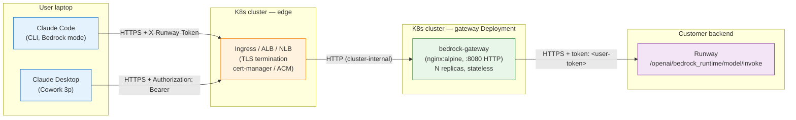

# Architecture

## Deployment topology

How the gateway sits in a customer environment. The gateway image only listens
on plain HTTP; TLS is always terminated one layer in front of it (Ingress, ALB,
or NLB+ACM). Every user brings their own token — the gateway is a shared
stateless proxy, not per-user.



**Boundaries:**

| Layer | Responsibility |
|---|---|
| Client (laptop) | Holds user token. Adds it to request via `ANTHROPIC_CUSTOM_HEADERS` (Claude Code) or `inferenceCredentialHelper` (Cowork) |
| Edge | TLS termination, WAF / rate limiting (optional), DNS / domain ownership |
| Gateway Pod | Strips AWS SigV4, extracts per-user token, rewrites path, injects upstream-specific auth header, forwards streaming or unary |
| Backend | Model inference. Sees a request that looks like standard Bedrock `InvokeModel` with a custom auth header |

---

## Request lifecycle

A single non-streaming request, end to end. The streaming path differs only in
that `proxy_buffering off` keeps chunks flowing as they arrive.

```mermaid
sequenceDiagram
    autonumber
    participant C as Claude Code / Cowork
    participant I as Ingress (TLS)
    participant G as Gateway (nginx)
    participant R as Runway

    C->>I: POST /model/{id}/invoke (HTTPS)<br/>Authorization: Bearer &lt;token&gt; (Cowork)<br/>or X-Runway-Token: &lt;token&gt; (Claude Code)<br/>X-Claude-Code-Session-Id
    Note over I: TLS terminates here.<br/>Cert from cert-manager / ACM / ...
    I->>G: POST /model/{id}/invoke (HTTP, in-cluster)

    rect rgb(240, 248, 255)
        Note over G: 1. Extract token (map $http_authorization / $http_x_runway_token)<br/>→ $client_token
        Note over G: 2. Validate: reject 401 if empty<br/>Validate: reject 405 if not POST<br/>Validate: reject 400 if path can't rewrite
        Note over G: 3. Sanitize $http_x_claude_code_session_id → $safe_session_id<br/>(UUID-ish chars only, ≤128B)
        Note over G: 4. Rewrite path:<br/>/model/{id}/invoke<br/>→ /openai/bedrock_runtime/model/invoke
        Note over G: 5. Scrub client AWS / auth headers:<br/>Authorization, X-Amz-*, X-Runway-Token
        Note over G: 6. Inject upstream auth:<br/>{AUTH_HEADER_NAME}: $client_token
    end

    G->>R: POST /openai/bedrock_runtime/model/invoke<br/>token: &lt;user-token&gt;<br/>X-Claude-Code-Session-Id: (sanitized)

    R-->>G: 200 OK + Bedrock invoke response
    G-->>I: 200 OK (proxy_buffering off for -stream variant)
    I-->>C: 200 OK

    Note over C,R: On upstream 4xx/5xx the gateway mirrors status + body verbatim.<br/>On unauth/malformed request the gateway returns a structured JSON error,<br/>never hitting upstream.
```

---

## Two clients, one gateway

The gateway accepts the same Bedrock `/model/{id}/invoke[-with-response-stream]`
wire format from both clients. The only per-client difference is where the
token arrives:

| Client | Config mechanism | Token header | Gateway extracts via |
|---|---|---|---|
| Claude Code (CLI) | `~/.claude/settings.json` env block | `X-Runway-Token: <token>` | `$http_x_runway_token` |
| Claude Cowork (Desktop) | MDM plist / Windows registry; `inferenceCredentialHelper` stdout | `Authorization: Bearer <token>` | `map` over `$http_authorization` |

Both land in the same `$client_token` variable. The upstream only ever sees one
consistent shape: `{AUTH_HEADER_NAME}: <token>`.

---

## Why these specific choices

- **HTTP-only inside the Pod** — TLS termination belongs to the Ingress layer;
  duplicating cert management in the app container couples ops to app release
  cadence and adds blast radius for any cert rotation bug.
- **Runtime DNS resolution** (`set $upstream_target ...`; `resolver ...`) —
  a static `upstream {}` block fails container startup if upstream DNS is
  briefly unreachable, e.g. during cluster rollouts. The variable form defers
  resolution to request time and survives intermittent DNS issues.
- **Header extraction via `map`, not `if`** — nginx `if` in `location` is a
  known source of surprising behaviour when it interacts with content-phase
  directives. `map` runs in the rewrite phase, once, deterministically.
- **Static `/v1/models` response** — keeps the Cowork / Claude Code model
  pickers populated without touching the upstream. Doubles as a model
  allowlist: edit the JSON literal to restrict which models users see.
- **`count_tokens` returns 501** — the upstream doesn't implement it; the
  clients fall back to local estimation, which is correct for UX and avoids
  adding a fake implementation that would drift.
